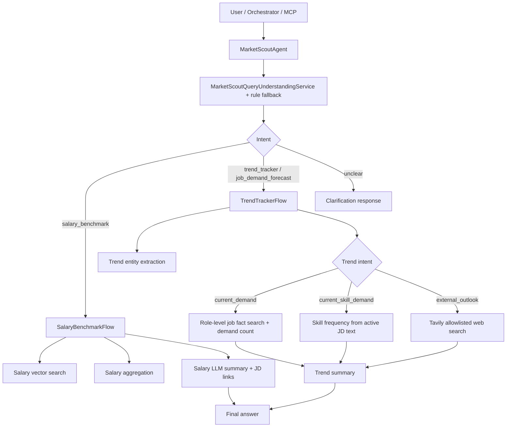

# Market Scout

Market Scout la agent khao sat thi truong nghe nghiep cua Z-MentorAI. Agent hien tap trung vao hai nhom nguoi dung chinh: sinh vien moi dinh huong nghe nghiep va nguoi muon chuyen nganh.

Scope san pham hien tai da duoc thu gon de tra loi tot hon thay vi cover qua rong:

- Salary Benchmark: thi truong dang tra muc luong khoang bao nhieu cho mot vi tri.
- Trend Tracker: nhu cau tuyen dung hien tai theo role cu the va trien vong nghe nghiep tu nguon ngoai.

Khong con dung nhanh `automation_exposure` rieng. Cac cau hoi ve AI thay the, nganh co nguy co giam nhu cau, hoac trien vong tuong lai duoc xu ly trong `external_outlook`.

## Runtime Entry Points

FastAPI service nam tai:

```text
backend/market_scout/main.py
```

Cac endpoint chinh:

| Endpoint | Muc dich |
| --- | --- |
| `POST /scout` | Endpoint tong, de MCP/orchestrator goi Market Scout. |
| `POST /salary-benchmark` | Chay rieng Salary Benchmark. |
| `POST /trend-tracker` | Chay rieng Trend Tracker. |
| `GET /health` | Health check cho Cloud Run. |

Luong dieu phoi chinh nam tai:

```text
backend/market_scout/agent.py
```

`MarketScoutAgent` nhan `user_query`, xac dinh intent, sau do route sang `SalaryBenchmarkFlow` hoac `TrendTrackerFlow`.

## High Level Flow



## Salary Benchmark

Salary Benchmark tra loi cac cau hoi nhu:

- `Muc luong DevOps o Ha Noi voi 2 nam kinh nghiem la bao nhieu?`
- `Luong Business Analyst tai Ho Chi Minh khoang bao nhieu?`
- `AI Engineer luong thi truong the nao?`

### Flow xu ly

1. `SalaryQueryUnderstandingService` dung LLM-first de trich xuat query salary.
2. Neu LLM khong tra duoc JSON hop le, fallback ve `SalaryQueryNormalizer`.
3. Query duoc chuyen thanh `SalarySearchQuery`, gom `job_title`, `location`, `experience_years`.
4. `SalaryVectorRepository` search trong collection embedding `data_vector_embeddings`.
5. `SalaryBenchmarkService` loc record hop le, loai outlier, roi aggregate salary range.
6. `SalarySummaryService` viet cau tra loi cuoi va append 3-5 JD links lien quan.

### Rule truy van salary

| Job | Location | Experience | Cach truy van |
| --- | --- | --- | --- |
| Co | Co | Co | Loc theo `job + location + experience`. |
| Co | Co | Khong | Loc theo `job + location`, tong hop moi experience. |
| Co | Khong | Co | Loc theo `job + experience`, tong hop moi location. |
| Co | Khong | Khong | Loc theo `job`, tong hop moi location va experience. |
| Khong | Bat ky | Bat ky | Hoi lai nguoi dung ve job cu the. |

### Data salary

Input du lieu da xu ly:

```text
data_for_vectorize
data_for_vectorize_202607
```

Embedding/search collection:

```text
data_vector_embeddings
```

Cac field quan trong trong embedding:

- `job_title`
- `company`
- `job_url`
- `locations`
- `min_experience`
- `salary_min_vnd`
- `salary_max_vnd`
- `salary_search_keys`
- `embedding`
- `embedding_text`
- `source_collection`

### Pipeline salary

Embed job records:

```powershell
& F:\Z-MentorAI\venv\Scripts\python.exe backend/market_scout/local_scripts/salary_benchmark/run_embedJobs.py `
  --source-collection data_for_vectorize_202607 `
  --dest-collection data_vector_embeddings
```

Estimate open-ended salary bounds:

```powershell
& F:\Z-MentorAI\venv\Scripts\python.exe backend/market_scout/local_scripts/salary_benchmark/run_estimateSalaryBounds.py `
  --collection data_vector_embeddings `
  --source-collection-filter data_for_vectorize_202607
```

Build salary search index fields:

```powershell
& F:\Z-MentorAI\venv\Scripts\python.exe backend/market_scout/local_scripts/salary_benchmark/run_buildSalaryIndex.py `
  --collection data_vector_embeddings `
  --source-collection-filter data_for_vectorize_202607
```

Test local:

```powershell
& F:\Z-MentorAI\venv\Scripts\python.exe backend/market_scout/local_scripts/salary_benchmark/run_salaryBenchmark.py `
  --query "Luong DevOps tai Ha Noi 2 nam kinh nghiem" `
  --top-k 5 `
  --fetch-k 80
```

## Trend Tracker

Trend Tracker hien co ba intent runtime:

| Intent | Muc dich |
| --- | --- |
| `current_demand` | Hoi vi tri/cong viec hien dang tuyen nhieu hay khong. |
| `current_skill_demand` | Hoi ky nang nao dang duoc nhac nhieu trong JD hien tai. |
| `external_outlook` | Hoi trien vong nghe nghiep, xu huong tuong lai, tac dong AI, nganh co con co hoi khong. |

### Current Demand theo role

Logic cu dung `trend_snapshots_v2` theo `job_family_id + location_id`, nen cac role trong cung mot family co the tra ra giong nhau. Logic moi chuyen sang role-level demand:

1. LLM/rule extractor lay `role_mention` va `location_text`.
2. `LocationResolverService` chuan hoa location, vi du `Ha Noi` -> `ha-noi`.
3. `RoleFactSearchService` search role trong `trend_job_facts_v2` bang keyword/title overlap va `job_mapping_embedding` bang semantic vector search.
4. Top-N matched job facts duoc dung de dem active JD count, distinct company count va top source JD links.
5. `CurrentDemandService.evaluate_role_demand(...)` phan loai nhu cau: high, moderate, limited, insufficient_evidence.
6. Summary tra loi theo vi tri cu the, khong noi chung o cap nganh neu user hoi role.

Vi du:

```text
business analyst tai Ha Noi co dang tuyen nhieu khong?
AI Engineer o Ha Noi co cao khong?
DevOps tai Ho Chi Minh co tuyen dung nhieu khong?
```

### Current Skill Demand

Current Skill Demand dung `SkillFrequencyService` de doc `requirements_text` va `description_text` tu active job facts, sau do match theo keyword taxonomy.

Output la tin hieu ky nang hien tai, khong phai skill growth trend.

Vi du cau hoi:

```text
Nganh IT tai Ha Noi dang can ky nang gi?
Vi tri software engineer hien thi truong hay yeu cau ky nang nao?
Sales o Ho Chi Minh thuong can ky nang gi?
```

### External Outlook

External Outlook dung cho cau hoi tuong lai hoac boi canh thi truong rong hon:

```text
DevOps engineer co con nhieu co hoi trong tuong lai khong?
Sales va marketing nam 2026 con trien vong khong?
Nganh nao co nguy co giam nhu cau vi AI?
AI/Data trong vai nam toi co con phat trien khong?
```

Logic hien tai:

1. Dung `AllowlistedWebSearchService` goi Tavily Search.
2. Search chi trong cac domain/source da cau hinh.
3. `ExternalOutlookLiveSearchService` lay snippet/content tu ket qua search.
4. `ExternalOutlookEvidenceExtractor` dung LLM de extract claim co cau truc.
5. Neu live search loi/timeout/khong co evidence tot, fallback sang cached `trend_evidence`.
6. Summary bat buoc dua link nguon markdown de user bam duoc.

Allowed source config:

```text
backend/market_scout/config/external_outlook_sources.json
```

Cac domain chinh:

- `pact-for-skills.ec.europa.eu`
- `www.ilo.org`
- `www.manpower.com.vn`
- `topdev.vn`
- `intech.vietnamworks.com`
- `www.adecco.com`
- `www.robertwalters.com.vn`

## Trend Tracker Data

### `trend_job_facts_v2`

Day la collection job facts, tuc la moi record dai dien cho mot tin tuyen dung da duoc chuan hoa.

Cac buoc chuan hoa chinh:

- chuan hoa `job_key`
- chuan hoa `company_key`
- chuan hoa `location_ids`
- parse ngay cap nhat/ngay het han
- xac dinh `is_active`
- map nganh nghe tho sang `job_category_ids` va `job_family_ids`
- giu lai `requirements_text` va `description_text`

Collection nay dung cho:

- role-level current demand
- current skill demand
- role mapping / semantic search

### `job_mapping_embedding`

Day la collection embedding dung de map role tu nhien tu user query sang cac JD tuong dong.

Cac field dang giu:

- `job_key`
- `source_document_id`
- `job_url`
- `job_title`
- `company`
- `location_ids`
- `source_expires_at`
- `raw_job_category_labels`
- `job_category_ids`
- `job_family_ids`
- `embedding_text`
- `embedding_model`
- `embedding_updated_at`
- `embedding`

### `trend_snapshots_v2`

Day la snapshot aggregate theo:

```text
job_family_id + location_id + period
```

Snapshot van huu ich cho boi canh nganh rong, nhung khong con la nguon chinh de tra loi nhu cau cua mot role cu the.

Cac field chinh:

- `job_family_id`
- `location_id`
- `period`
- `observed_job_count`
- `active_job_count`
- `updated_job_count`
- `distinct_company_count`
- `source_job_counts`

### `trend_sources` va `trend_evidence`

`trend_sources` luu metadata nguon ngoai:

- report/article title
- publisher
- URL
- published date
- reliability score
- scope location

`trend_evidence` luu cac claim da extract/manual ingest:

- `evidence_id`
- `source_id`
- `job_family_ids`
- `job_category_ids`
- `location_ids`
- `direction`
- `exact_claim`
- `citation`
- `confidence`

Hien tai cached evidence chi la fallback cho external outlook, khong thay the live allowlisted web search.

## Query Understanding

Service chinh:

```text
backend/market_scout/services/market_scout_query_understanding_service.py
```

Luong:

1. Heuristic phan loai nhanh salary/trend.
2. Neu can, LLM trich xuat structured output.
3. Salary query dung `SalaryQueryUnderstandingService`.
4. Trend query dung `TrendEntityExtractorService`.
5. Neu LLM loi hoac thieu field, fallback bang rule/keyword/taxonomy.

Trend structured fields:

- `trend_intent`
- `role_mention`
- `job_category_hint`
- `job_family_hint`
- `location_text`

Salary structured fields:

- `job_title`
- `location`
- `experience_years`

## Logging

Market Scout co structured logging de debug tren Cloud Run.

Cac log nen quan sat:

- `agent_request_received`
- `salary_flow_total`
- `trend_flow_total`
- `salary_vector_search`
- `salary_aggregate`
- `salary_summary`
- `mcp_tool_call`
- `mcp_tool_response`

Xem log Cloud Run:

```bash
gcloud logging read \
  'resource.type="cloud_run_revision" AND resource.labels.service_name="market-scout"' \
  --project=z-mentorai \
  --limit=50 \
  --format=json
```

## Environment Variables

Cac bien quan trong:

| Env var | Muc dich |
| --- | --- |
| `GOOGLE_CLOUD_PROJECT` | GCP project id. |
| `GOOGLE_APPLICATION_CREDENTIALS` | Local service account path neu chay local. |
| `VERTEX_AI_LOCATION` | Region Vertex AI. |
| `TAVILY_API_KEY` | API key cho allowlisted live web search. |
| `MARKET_SCOUT_URL` | MCP goi toi Cloud Run Market Scout. |

Tren Cloud Run nen dung IAM/service account va Secret Manager, khong commit `.env` hoac `service_account.json`.

## Local Test Commands

Salary Benchmark:

```powershell
& F:\Z-MentorAI\venv\Scripts\python.exe backend/market_scout/local_scripts/salary_benchmark/run_salaryBenchmark.py `
  --query "muc luong DevOps tai Ha Noi voi 2 nam kinh nghiem" `
  --top-k 5 `
  --fetch-k 80
```

Current Demand:

```powershell
& F:\Z-MentorAI\venv\Scripts\python.exe backend/market_scout/local_scripts/trend_tracker/run_currentDemandQuestion.py
```

Trend Tracker:

```powershell
& F:\Z-MentorAI\venv\Scripts\python.exe backend/market_scout/run_trendTracker.py `
  --query "business analyst tai Ha Noi co dang tuyen nhieu khong?"
```

External Outlook:

```powershell
& F:\Z-MentorAI\venv\Scripts\python.exe backend/market_scout/run_trendTracker.py `
  --query "DevOps engineer co con nhieu co hoi trong tuong lai khong?"
```

Unit tests:

```powershell
& F:\Z-MentorAI\venv\Scripts\python.exe -m pytest backend/market_scout/tests
```

## Current Limitations

- Salary aggregation hien van la deterministic aggregation sau retrieval; weighted percentile la huong can enhance tiep.
- Current demand theo role phu thuoc chat luong semantic search va du lieu JD da crawl.
- Current skill demand van dua tren keyword taxonomy, co the bo sot ky nang viet theo cach khac.
- External outlook phu thuoc Tavily va chat luong snippet/content tu allowlisted domains.
- Khong dung mot snapshot de ket luan thi truong tang/giam. Current demand chi la trang thai hien tai.

## Need Enhance: CV Context to Salary Benchmark

Profile Scanner hien da doc CV, cham diem va luu thong tin trich xuat. Du lieu CV duoc luu trong:

```text
backend/profile_scanner/
```

Firestore collection mac dinh:

```text
profile_scanner_cv_documents
```

Ten collection duoc cau hinh boi env:

```text
CV_DOCUMENTS_COLLECTION
```

Cac file lien quan:

| File | Vai tro |
| --- | --- |
| `backend/profile_scanner/cv_intake/repository.py` | Luu, doc, update CV document trong Firestore. |
| `backend/profile_scanner/cv_intake/service.py` | Tao metadata ban dau khi user upload CV. |
| `backend/profile_scanner/cv_extraction/service.py` | Parse text tu PDF/DOCX/image va luu artifact vao GCS. |
| `backend/profile_scanner/profile_analysis/service.py` | Cham diem CV, extract skills, work experience, target role, structured profile. |
| `backend/profile_scanner/profile_analysis/schemas.py` | Schema `ProfileAnalysisResult`. |
| `backend/profile_scanner/profile_ai_extraction/schemas.py` | Schema `StructuredProfile`. |

Cac field huu ich cho salary benchmark:

- top-level `target_role`
- `profile_analysis.target_role`
- `profile_analysis.extracted_skills`
- `profile_analysis.work_experiences`
- `structured_profile.target_role_hint`
- `structured_profile.skills`
- `structured_profile.work_experiences`

Enhancement mong muon:

Khi user gui CV va hoi:

```text
Voi CV nay thi thi truong dang tra muc luong bao nhieu?
```

Agent can lay duoc market salary context tu Profile Scanner:

```json
{
  "job_title": "Business Analyst",
  "location": "Ha Noi",
  "experience_years": 3
}
```

Neu CV chi co seniority, quy doi tam:

| Seniority | Experience years dung cho salary |
| --- | --- |
| `junior` | 1-3 nam |
| `middle` / `mid-level` | 3-5 nam |
| `senior` | 5-8 nam |
| `lead` / `manager` | 8+ nam |

De xuat implementation:

1. Profile Scanner bo sung output `market_salary_context`.
2. Orchestrator khi thay user hoi salary dua tren CV se goi `profile_scanner` truoc.
3. Orchestrator truyen `job_title`, `location`, `experience_years` hoac `seniority` sang `salary_benchmark`.
4. Market Scout enrich salary query tu context nay roi chay `SalaryBenchmarkFlow`.
5. Neu thieu `job_title`, hoi lai user muon benchmark vi tri nao.

Muc tieu la de user khong can nhap lai toan bo thong tin neu CV da chua du role, ky nang va kinh nghiem.
