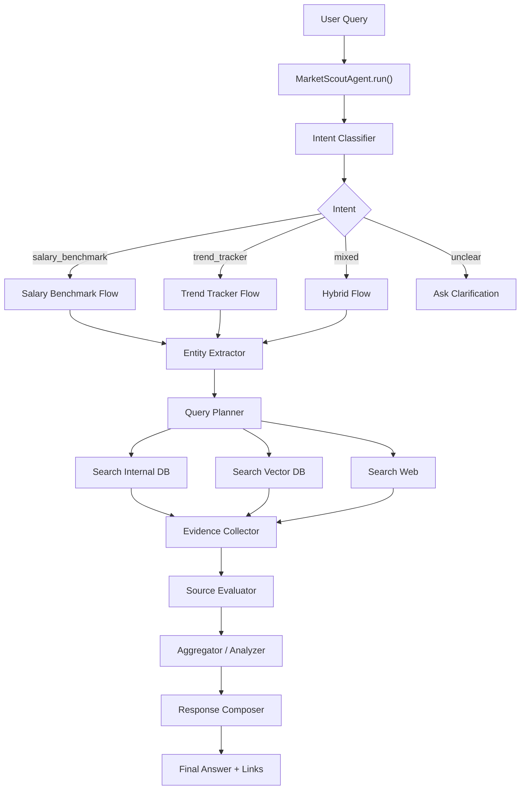
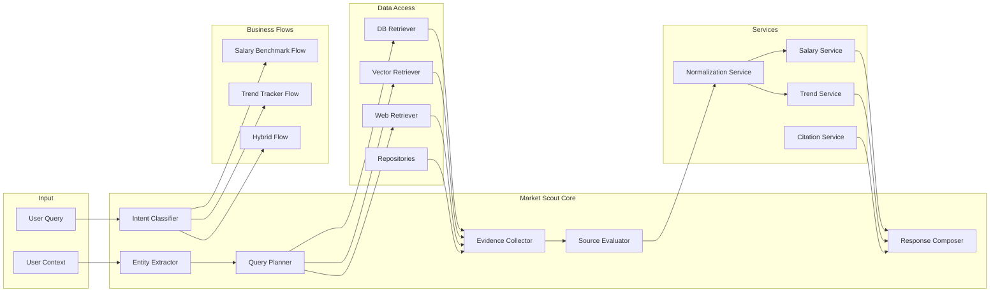
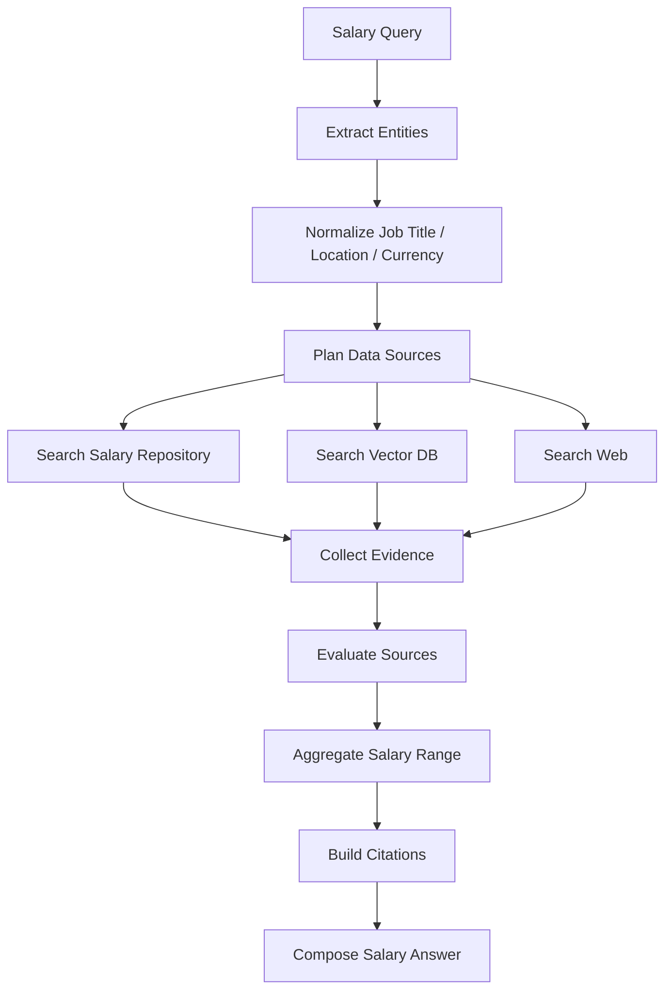
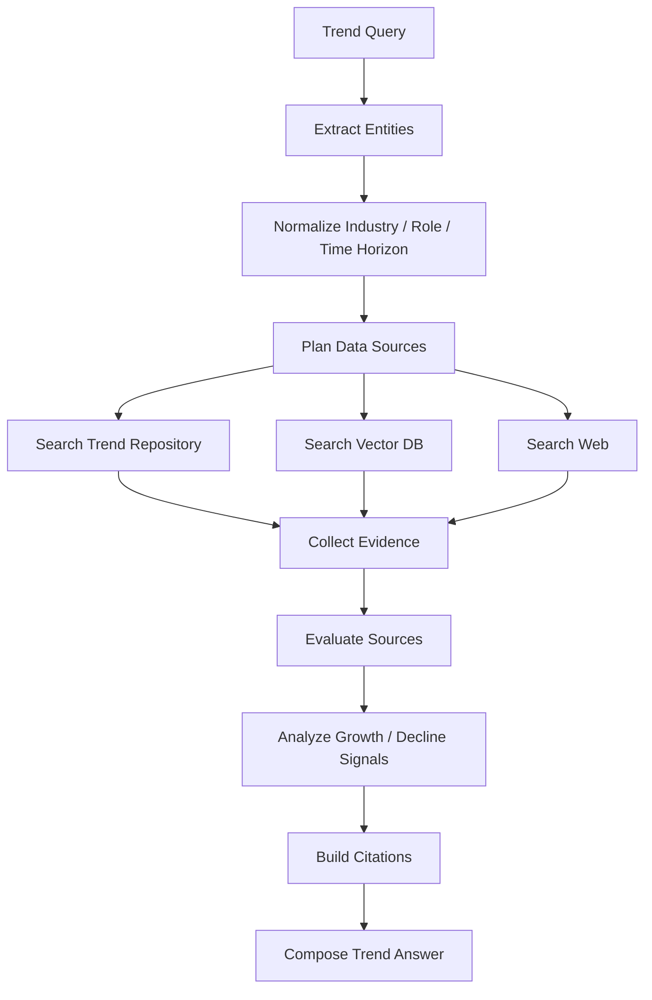

# Market Scout Agent

Market Scout is the market intelligence agent in z-MentorAI. It answers user questions about salary benchmarks, job market trends, future hiring demand, and roles or industries that may decline because of automation or market changes.

The agent should return a clear answer with supporting source links from the internal database, vector database, or external web search.

## Main Responsibilities

- Salary benchmark: estimate salary ranges for a job title based on experience, location, seniority, and currency.
- Trend tracker: summarize career and industry trends over a selected time horizon.
- Job demand forecast: identify roles or industries likely to need more workers.
- Decline risk analysis: identify roles or industries with high automation or market decline risk.
- Source citation: include links, reports, articles, or internal records used to generate the answer.

## Runtime Flow



## Detailed Architecture



## Salary Benchmark Flow



Expected output fields:

```json
{
  "agent": "market_scout",
  "intent": "salary_benchmark",
  "answer": "...",
  "confidence": "medium",
  "data": {
    "job_title": "Business Analyst",
    "location": "Vietnam",
    "experience_years": 5,
    "salary_range": {
      "min": 25000000,
      "max": 45000000,
      "currency": "VND",
      "period": "monthly"
    }
  },
  "sources": [],
  "limitations": []
}
```

## Trend Tracker Flow



Expected output fields:

```json
{
  "agent": "market_scout",
  "intent": "trend_tracker",
  "answer": "...",
  "confidence": "medium",
  "data": {
    "industry": "AI/Data",
    "location": "Vietnam",
    "time_horizon": "2026-2030",
    "growth_roles": [],
    "declining_roles": [],
    "market_signals": []
  },
  "sources": [],
  "limitations": []
}
```

## Folder Structure

```text
backend/
└── market_scout/
    ├── __init__.py
    ├── agent.py
    ├── config.py
    ├── README.md
    │
    ├── api/
    │   ├── __init__.py
    │   └── routes.py
    │
    ├── core/
    │   ├── __init__.py
    │   ├── intent_classifier.py
    │   ├── entity_extractor.py
    │   ├── query_planner.py
    │   ├── evidence_collector.py
    │   ├── source_evaluator.py
    │   └── response_composer.py
    │
    ├── flows/
    │   ├── __init__.py
    │   ├── salary_benchmark_flow.py
    │   ├── trend_tracker_flow.py
    │   └── hybrid_flow.py
    │
    ├── retrievers/
    │   ├── __init__.py
    │   ├── db_retriever.py
    │   ├── vector_retriever.py
    │   └── web_retriever.py
    │
    ├── services/
    │   ├── __init__.py
    │   ├── salary_service.py
    │   ├── trend_service.py
    │   ├── citation_service.py
    │   └── normalization_service.py
    │
    ├── schemas/
    │   ├── __init__.py
    │   ├── request.py
    │   ├── response.py
    │   ├── entities.py
    │   └── source.py
    |   |__ enums.py
    │
    ├── prompts/
    │   ├── intent_classifier_prompt.txt
    │   ├── entity_extractor_prompt.txt
    │   ├── salary_answer_prompt.txt
    │   └── trend_answer_prompt.txt
    │
    ├── repositories/
    │   ├── __init__.py
    │   ├── salary_repository.py
    │   ├── trend_repository.py
    │   └── source_repository.py
    │
    ├── pipelines/
    │   ├── __init__.py
    │   ├── ingest_sources_pipeline.py
    │   ├── extract_salary_pipeline.py
    │   └── extract_trend_pipeline.py
    │
    └── tests/
        ├── test_intent_classifier.py
        ├── test_entity_extractor.py
        ├── test_salary_flow.py
        └── test_trend_flow.py
```

## Task Plan

1. Define schemas.

   Files:

   ```text
   schemas/request.py
   schemas/response.py
   schemas/entities.py
   schemas/source.py
   schemas/__init__.py
   ```

2. Build the MarketScoutAgent entrypoint.

   Files:

   ```text
   agent.py
   __init__.py
   ```

3. Build the intent classifier.

   Files:

   ```text
   core/intent_classifier.py
   prompts/intent_classifier_prompt.txt
   ```

4. Build the entity extractor.

   Files:

   ```text
   core/entity_extractor.py
   prompts/entity_extractor_prompt.txt
   ```

5. Build the query planner.

   Files:

   ```text
   core/query_planner.py
   ```

6. Build retrievers.

   Files:

   ```text
   retrievers/db_retriever.py
   retrievers/vector_retriever.py
   retrievers/web_retriever.py
   retrievers/__init__.py
   ```

7. Build repositories.

   Files:

   ```text
   repositories/salary_repository.py
   repositories/trend_repository.py
   repositories/source_repository.py
   repositories/__init__.py
   ```

8. Build the evidence collector.

   Files:

   ```text
   core/evidence_collector.py
   ```

9. Build the source evaluator.

   Files:

   ```text
   core/source_evaluator.py
   ```

10. Build the normalization service.

    Files:

    ```text
    services/normalization_service.py
    ```

11. Build the salary service.

    Files:

    ```text
    services/salary_service.py
    ```

12. Build the trend service.

    Files:

    ```text
    services/trend_service.py
    ```

13. Build the citation service.

    Files:

    ```text
    services/citation_service.py
    ```

14. Build the salary benchmark flow.

    Files:

    ```text
    flows/salary_benchmark_flow.py
    ```

15. Build the trend tracker flow.

    Files:

    ```text
    flows/trend_tracker_flow.py
    ```

16. Build the hybrid flow.

    Files:

    ```text
    flows/hybrid_flow.py
    flows/__init__.py
    ```

17. Build the response composer.

    Files:

    ```text
    core/response_composer.py
    prompts/salary_answer_prompt.txt
    prompts/trend_answer_prompt.txt
    ```

18. Build API routes if Market Scout is called through HTTP.

    Files:

    ```text
    api/routes.py
    api/__init__.py
    ```

19. Build background pipelines.

    Files:

    ```text
    pipelines/ingest_sources_pipeline.py
    pipelines/extract_salary_pipeline.py
    pipelines/extract_trend_pipeline.py
    pipelines/__init__.py
    ```

20. Write unit tests.

    Files:

    ```text
    tests/test_intent_classifier.py
    tests/test_entity_extractor.py
    tests/test_salary_flow.py
    tests/test_trend_flow.py
    ```

## Implementation Order Summary

```text
schemas
-> agent.py
-> intent_classifier
-> entity_extractor
-> query_planner
-> retrievers
-> repositories
-> evidence_collector
-> source_evaluator
-> services
-> salary_benchmark_flow
-> trend_tracker_flow
-> hybrid_flow
-> response_composer
-> api routes
-> pipelines
-> tests
```

## Notes

- Internal DB should be preferred when data is available and fresh.
- Web search should be used when internal data is missing, outdated, or not specific enough.
- Every final answer should include source links when evidence is available.
- Salary answers should mention assumptions such as location, seniority, experience, and currency.
- Trend answers should mention time horizon and confidence level.
- Source evaluation should consider freshness, publisher reliability, relevance, and whether the source contains concrete data.

## Firestore Job Cleaning Pipeline

The raw crawled data from TopCV and CareerViet should be cleaned into one Firestore collection before it is used by Salary Benchmark or Trend Tracker.

Cleaned job schema:

```json
{
  "job_id": "35B27987",
  "job_url": "https://...",
  "company": "FUKUSHIMA GALILEI VIETNAM COMPANY LIMITED",
  "job_title": "QUẢN LÝ DỰ ÁN ĐIỆN LẠNH",
  "location": "Hồ Chí Minh",
  "benefits": ["Du lịch nước ngoài", "Đồng phục", "Chế độ thưởng"],
  "salary_raw": "14 Tr - 18 Tr VND",
  "salary_min": 14000000,
  "salary_max": 18000000,
  "currency": "VND"
}
```

Cleaning rules:

- Salary is parsed from the salary column first, for example `Lương`, `Mức lương`, or `salary`.
- If the salary column is missing or non-numeric, for example `Thỏa thuận`, the pipeline tries to parse `Thông tin khác`.
- Benefit fields can come from array fields such as `benefits` or numeric keys such as `4`, `5`, `6`.
- Records without `company` or `job_title` are skipped by default because they are unsafe for deduplication.

Deduplication rules:

- Exact duplicates are removed first by normalized `job_url` or normalized `company + job_title + location + salary`.
- Near duplicates are detected with cosine similarity over weighted text features: company, job title, location, salary, and job requirements.
- Near-duplicate comparison only applies when the normalized company matches, or when one record is missing company, to avoid merging similar jobs from different companies.
- The default similarity threshold is `0.86`.

Run a dry-run:

```bash
python backend/market_scout/run_cleanJobs.py --raw-collection raw_jobs --cleaned-collection cleaned_jobs --dry-run
```

Configure Firestore credentials in `backend/market_scout/.env`:

```env
GOOGLE_CLOUD_PROJECT=your-gcp-project-id
GOOGLE_APPLICATION_CREDENTIALS=path/to/service-account.json
```

Validate the environment without reading Firestore:

```bash
python backend/market_scout/run_cleanJobs.py --check-env
```

Run and write cleaned documents:

```bash
python backend/market_scout/run_cleanJobs.py --raw-collection raw_jobs --cleaned-collection cleaned_jobs
```

Useful options:

```bash
python backend/market_scout/run_cleanJobs.py --limit 100 --similarity-threshold 0.82 --dry-run
python backend/market_scout/run_cleanJobs.py --raw-collection jobs_raw --cleaned-collection jobs_cleaned --no-overwrite
```
