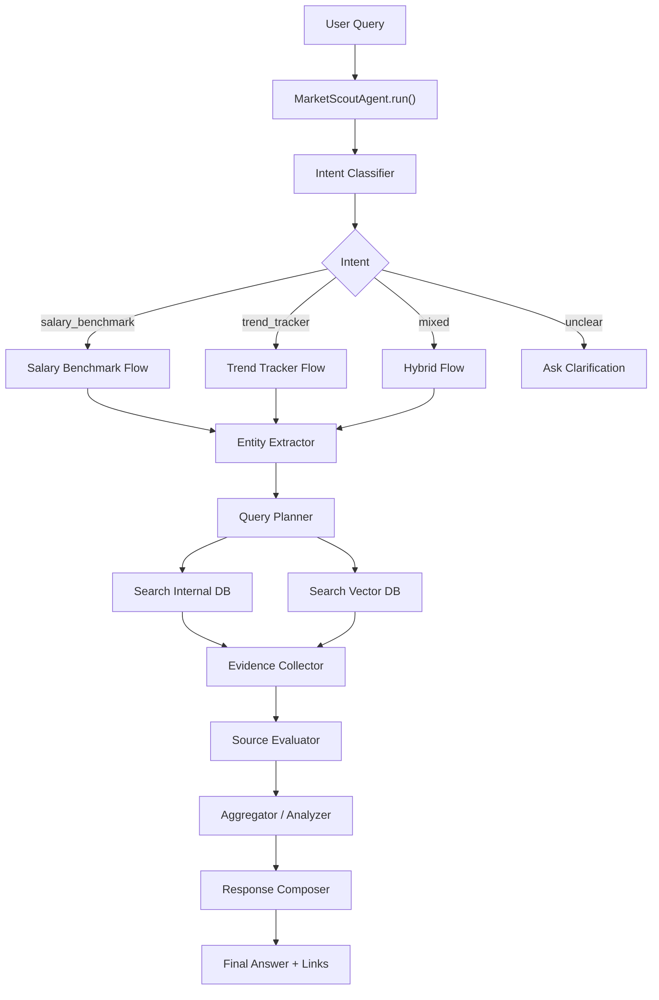
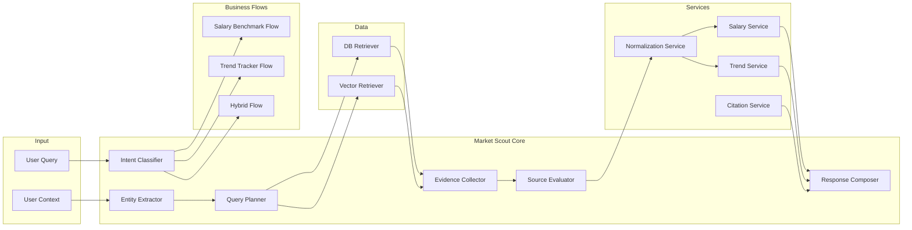
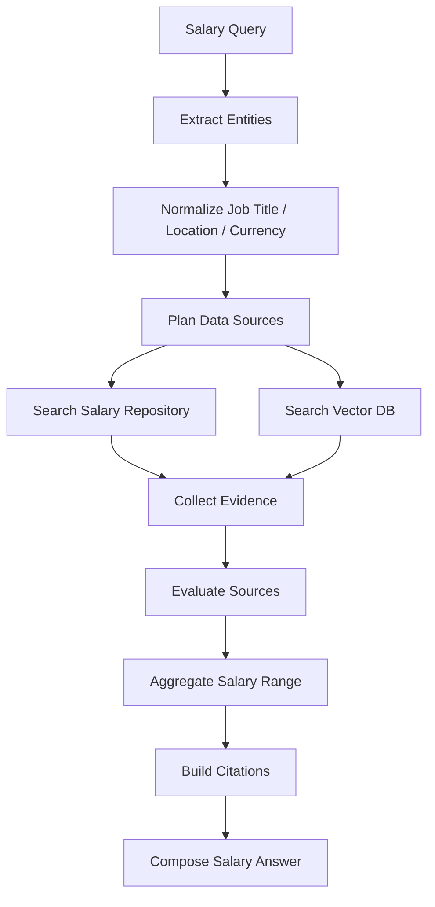
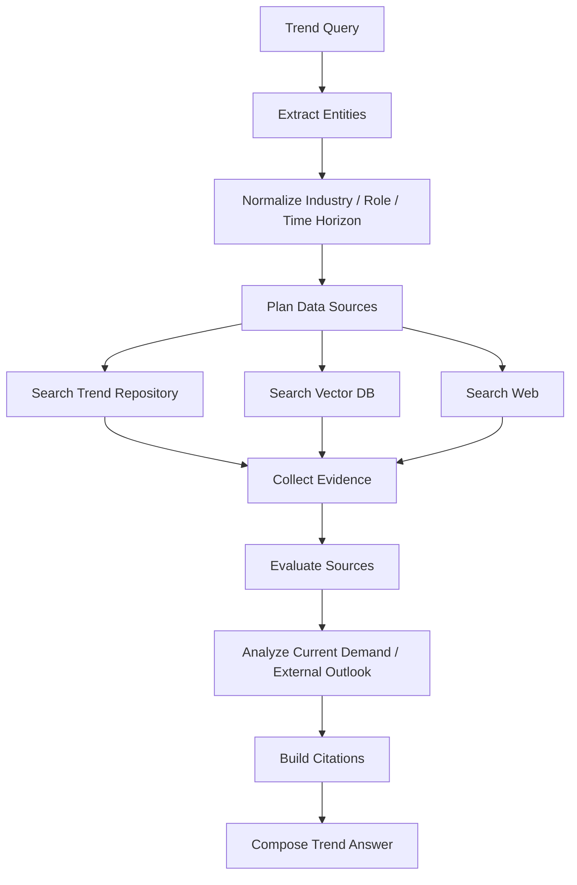
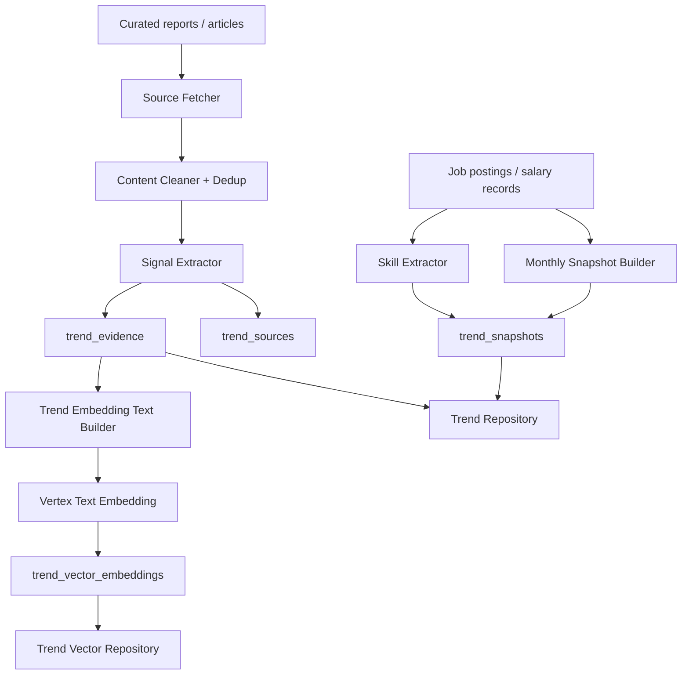
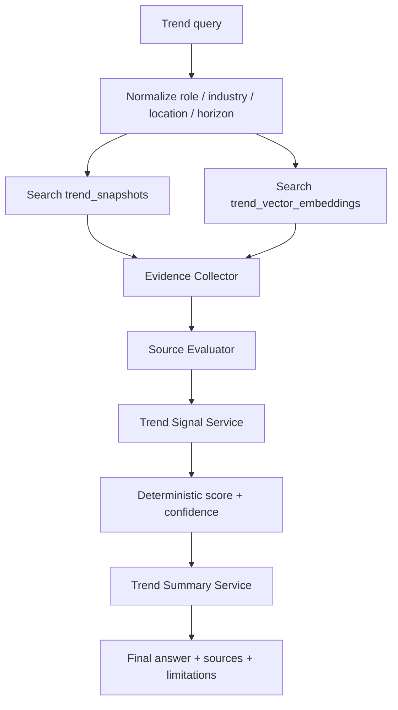

# Market Scout Agent

Market Scout is the market intelligence agent in z-MentorAI. It answers user questions about salary benchmarks, current hiring demand, current skill demand, and external job-market outlook from curated or allowlisted sources.

The agent should return a clear answer with supporting source links from the internal database, vector database, or external web search.

## Main Responsibilities

- Salary benchmark: estimate salary ranges for a job title based on experience, location, seniority, and currency.
- Trend tracker: summarize career and industry trends over a selected time horizon.
- Job demand forecast: identify roles or industries likely to need more workers.
- Decline risk analysis: identify roles or industries with high automation or market decline risk.
- Source citation: include links, reports, articles, or internal records used to generate the answer.

## Runtime Flow



## Detailed Architecture



## Salary Benchmark Flow



Expected output fields:

```json
{
  "agent": "market_scout",
  "intent": "salary_benchmark",
  "answer": "...",
  "confidence": "medium",
  "data": {
    "job_title": "Business Analyst",
    "location": "Vietnam",
    "experience_years": 5,
    "salary_range": {
      "min": 25000000,
      "max": 45000000,
      "currency": "VND",
      "period": "monthly"
    }
  },
  "sources": [],
  "limitations": []
}
```

## Trend Tracker Flow



Expected output fields:

```json
{
  "agent": "market_scout",
  "intent": "trend_tracker",
  "answer": "...",
  "confidence": "medium",
  "data": {
    "industry": "AI/Data",
    "location": "Vietnam",
    "time_horizon": "2026-2030",
    "growth_roles": [],
    "declining_roles": [],
    "market_signals": []
  },
  "sources": [],
  "limitations": []
}

```

## Trend Tracker Solution Design

Trend Tracker should be a signal-based analysis system, not a heavy forecasting model. Raw job volume is only one signal because large industries can always have many postings. The trend decision should be based on velocity, salary pressure, skill movement, external evidence quality, and freshness.

### Offline Data Pipeline



### Runtime Query Flow



### Firestore Collections

`trend_sources` stores source metadata and source quality signals.

```json
{
  "source_id": "report_2026_001",
  "url": "https://example.com/report",
  "title": "Vietnam hiring outlook 2026",
  "publisher": "Example Research",
  "source_type": "report",
  "published_at": "2026-05-01",
  "fetched_at": "2026-06-18",
  "reliability_score": 0.8,
  "content_hash": "sha256...",
  "location_scope": "Vietnam",
  "industries": ["AI/Data"],
  "roles": ["Data Engineer", "AI Engineer"]
}
```

`trend_evidence` stores structured signals extracted from internal snapshots, reports, or articles.

```json
{
  "evidence_id": "evidence_001",
  "source_id": "report_2026_001",
  "industry": "AI/Data",
  "role": "Data Engineer",
  "location": "Vietnam",
  "time_horizon": "2026",
  "signal_type": "hiring_growth",
  "direction": "growth",
  "magnitude": 0.32,
  "metric_value": 32,
  "metric_unit": "percent_yoy",
  "summary": "Data engineering demand increased year over year.",
  "published_at": "2026-05-01",
  "confidence": "medium"
}
```

`trend_snapshots` stores deterministic monthly aggregates from internal job and salary data.

```json
{
  "period": "2026-06",
  "industry": "AI/Data",
  "role": "Data Engineer",
  "location": "Vietnam",
  "job_count": 128,
  "job_share": 0.041,
  "company_count": 72,
  "mom_growth": 0.18,
  "qoq_growth": 0.31,
  "median_salary_vnd": 42000000,
  "salary_growth": 0.09,
  "skill_mentions": {
    "rag": 35,
    "gcp": 22,
    "data_pipeline": 64
  },
  "trend_score": 0.72,
  "confidence": "medium"
}
```

`trend_vector_embeddings` stores embedding-ready trend evidence. Use explicit labels and stable fields so vectors do not churn unnecessarily.

```text
Industry: AI/Data
Role: Data Engineer
Location: Vietnam
Time horizon: 2026
Signal type: hiring_growth
Direction: growth
Metric: 32 percent_yoy
Evidence: Data engineering demand increased year over year.
Source: Example Research
Published date: 2026-05-01
```

### Trend Scoring

Trend scoring should be deterministic and explainable.

```text
trend_score =
  0.35 * hiring_velocity
+ 0.20 * salary_pressure
+ 0.20 * skill_velocity
+ 0.15 * external_evidence
+ 0.10 * freshness_reliability
```

Signal definitions:

- `hiring_velocity`: normalized MoM/QoQ growth, job share growth, and distinct company growth.
- `salary_pressure`: salary median growth and salary premium compared with the broader market.
- `skill_velocity`: growth in role-specific skill mentions, not raw mention count.
- `external_evidence`: number and strength of relevant external sources with concrete data.
- `freshness_reliability`: source recency and publisher reliability.

Confidence should depend on evidence quality:

- `high`: internal snapshots cover at least 3 periods and external sources are fresh/reliable.
- `medium`: internal snapshots are available but sparse, or external evidence is good but limited.
- `low`: no time-series history, weak vector matches, stale sources, or only generic articles.

### Implementation Modules

```text
schemas/trend.py
repositories/trend_repository.py
repositories/trend_vector_repository.py
services/trend_query_normalizer.py
services/trend_embedding_text_service.py
services/trend_signal_service.py
services/trend_summary_service.py
flows/trend_tracker_flow.py
pipelines/build_trend_snapshots_pipeline.py
pipelines/ingest_trend_sources_pipeline.py
```

Recommended boundaries:

- `flows/`: orchestrate retrieval, evaluation, scoring, and summary composition.
- `services/`: normalize queries, build embedding text, score signals, and summarize results.
- `repositories/`: isolate Firestore and vector search calls.
- `schemas/`: define request, evidence, snapshot, score, source, and response contracts.
- `pipelines/`: build monthly snapshots and ingest external evidence offline.

### MVP Build Order

1. Build `trend_snapshots` from internal job data first. If historical `posted_at` or `crawled_at` is missing, return current demand with low confidence instead of claiming a trend.
2. Add deterministic `TrendSignalService` for hiring velocity, salary pressure, skill velocity, and confidence.
3. Add curated source ingestion for reports/articles, with URL/content hash deduplication.
4. Embed `trend_evidence` and create `TrendVectorRepository`.
5. Add `TrendTrackerFlow` and connect it to `MarketScoutAgent`.
6. Add focused tests for query normalization, scoring, source evaluation, embedding text, vector filtering, and flow orchestration.

### Limitations

- Do not use raw job count alone as the trend signal.
- Do not claim future forecasts unless the answer clearly states the time horizon, evidence strength, and limitations.
- Do not use LLM output as the source of truth for trend score. The LLM should only summarize deterministic evidence and cite sources.
- Web search should be a fallback or enrichment path, not the primary runtime dependency.

## Notes

- Internal DB should be preferred when data is available and fresh.
- Web search should be used when internal data is missing, outdated, or not specific enough.
- Every final answer should include source links when evidence is available.
- Salary answers should mention assumptions such as location, seniority, experience, and currency.
- Trend answers should mention time horizon and confidence level.
- Source evaluation should consider freshness, publisher reliability, relevance, and whether the source contains concrete data.

## Tech stack: Google cloud platform
- Objectives: build a system light-weight, low-cost 

