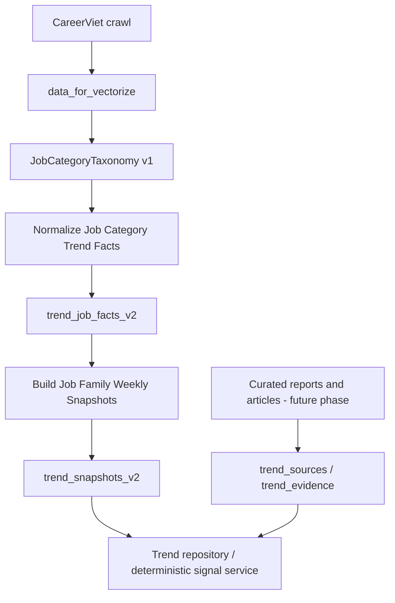
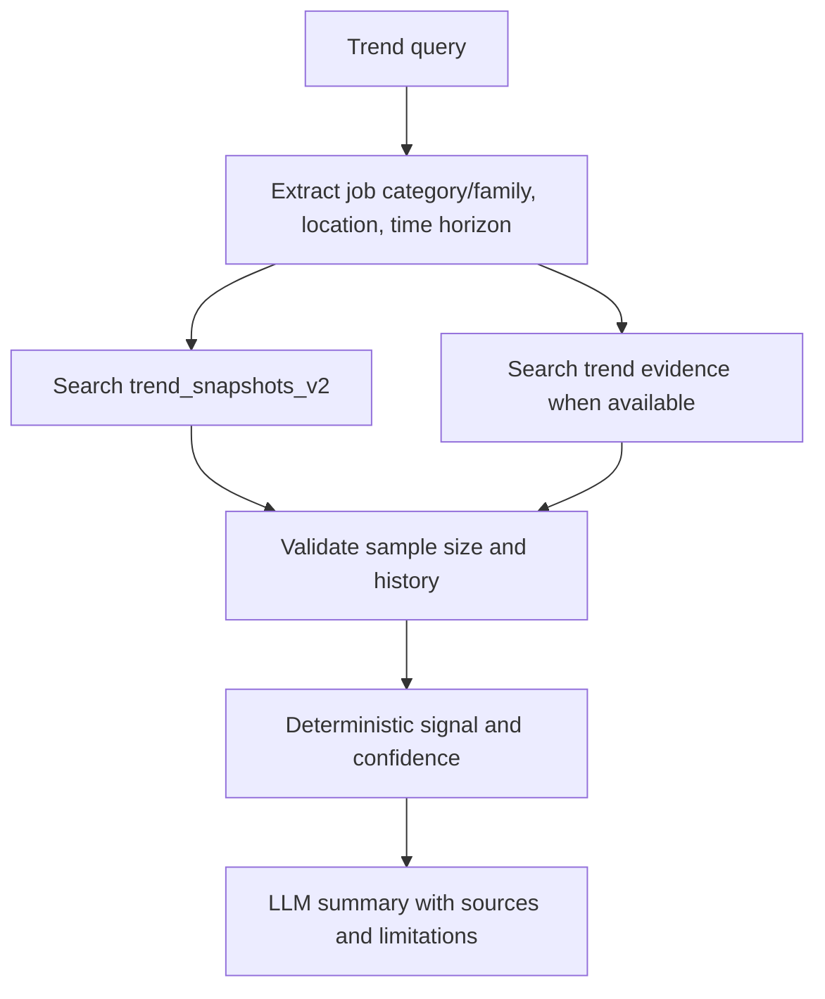

# Trend Tracker v2

## Mục tiêu

Trend Tracker theo dõi **nhu cầu tuyển dụng** từ JD nội bộ theo thời gian. Hệ thống không dùng raw job count đơn lẻ để khẳng định một market trend; mọi kết luận phải dựa trên snapshot time series, sample size và evidence bên ngoài khi có.

LLM không quyết định metric hoặc trend score. LLM chỉ tổng hợp deterministic evidence, citations và limitations thành câu trả lời.

## Phạm vi Hiện Tại

Field `Ngành nghề` của CareerViet là **job category / job function**, không phải industry thuần của doanh nghiệp.

Ví dụ:

- `Kế toán / Kiểm toán`, `Bán hàng / Kinh doanh`: function.
- `Xây dựng`, `Bất động sản`: gần với business vertical hơn.
- Một JD có thể đồng thời có `Quản lý chất lượng (QA/QC)` và `Thực phẩm & Đồ uống`.

Vì vậy v2 đo hiring demand theo `job_family_id + location_id + week`. Không được diễn giải trực tiếp là tăng hoặc giảm của toàn industry.

## Taxonomy

`JobCategoryTaxonomy v1` được seed từ 72 raw labels trong dữ liệu CareerViet:

- 70 job category hợp lệ.
- `Tỉnh` và `Thành Phố` là invalid labels, không được dùng làm category.
- Profile trên `data_for_vectorize` đã map toàn bộ 47,718 category-label occurrences, với `mapped_label_coverage = 1.0`.

Taxonomy có hai tầng:

```text
Raw Ngành nghề
  -> job_category_id (L2)
  -> job_family_id (L1)
```

Ví dụ:

```text
Quản lý chất lượng (QA/QC) -> quality_assurance -> operations
Thực phẩm & Đồ uống        -> food_beverage    -> people_services
Kế toán / Kiểm toán        -> accounting_audit -> finance_legal
CNTT - Phần mềm            -> software_it     -> digital_telecom
```

Category mới không có trong taxonomy phải vào `unmatched_job_category_labels`; không tự tạo slug category mới vì sẽ làm phân mảnh metric.

## Data Flow



## Firestore Collections

| Collection | Vai trò |
| --- | --- |
| `data_for_vectorize` | JD current state sau crawl và clean. |
| `trend_job_facts_v2` | JD normalized với job category/family dimensions. |
| `trend_snapshots_v2` | Weekly aggregate theo job family và location. |
| `trend_job_facts` | Legacy v1 facts, chỉ giữ audit. |
| `trend_snapshots` | Legacy v1 snapshots, chỉ giữ audit. |

Không dùng `trend_job_facts` hoặc `trend_snapshots` v1 cho scoring v2.

## `trend_job_facts_v2`

Fact v2 giữ đủ raw-normalized fields cho role taxonomy và skill extraction ở phase sau.

```json
{
  "job_key": "careerviet:35C19E7E",
  "source": "careerviet",
  "source_job_id": "35C19E7E",
  "job_url": "https://careerviet.vn/...",
  "job_title": "Nhân Viên Quản lý Chất Lượng - Ngành Thực Phẩm",
  "company": "Example Foods",
  "company_key": "example-foods",
  "location_ids": ["ho-chi-minh"],
  "seniority": "nhan-vien",
  "employment_type": "nhan-vien-chinh-thuc",
  "source_updated_at": "2026-05-23",
  "source_expires_at": "2026-06-21",
  "is_active": true,
  "requirements_text": "...",
  "description_text": "...",
  "raw_job_category_labels": [
    "Quản lý chất lượng (QA/QC)",
    "Thực phẩm & Đồ uống"
  ],
  "job_category_ids": ["quality_assurance", "food_beverage"],
  "job_family_ids": ["operations", "people_services"],
  "unmatched_job_category_labels": [],
  "invalid_job_category_labels": [],
  "taxonomy_version": "job-category-taxonomy-v1",
  "normalizer_version": "job-category-trend-job-fact-v2"
}
```

JD không có `Ngành nghề` vẫn được lưu để audit, nhưng không có `job_category_ids` và không đi vào snapshot aggregate.

Fact v2 không có `industry_ids`, `primary_industry_id`, `role_id` hoặc `skill_ids`.

## `trend_snapshots_v2`

Snapshot v2 được tạo theo khóa:

```text
period + job_family_id + location_id
```

Ví dụ document ID:

```text
2026-W25__finance_legal__ho-chi-minh
```

```json
{
  "snapshot_id": "2026-W25__finance_legal__ho-chi-minh",
  "period": "2026-W25",
  "period_start": "2026-06-15",
  "period_end": "2026-06-21",
  "job_family_id": "finance_legal",
  "location_id": "ho-chi-minh",
  "observed_job_count": 120,
  "active_job_count": 92,
  "unknown_active_job_count": 4,
  "updated_job_count": 18,
  "distinct_company_count": 46,
  "source_job_counts": {"careerviet": 120},
  "taxonomy_version": "job-category-taxonomy-v1",
  "fact_collection": "trend_job_facts_v2",
  "schema_version": 2
}
```

Metric semantics:

- `observed_job_count`: số JD unique có thể quan sát tại hoặc trước `period_end` trong family-location đó.
- `active_job_count`: số JD có `source_expires_at >= period_end`.
- `unknown_active_job_count`: số JD không có expiry date.
- `updated_job_count`: số JD có `source_updated_at` trong `[period_start, period_end]`. Đây là listing momentum, không khẳng định là số JD mới đăng.
- `distinct_company_count`: số company unique trong active JD.

Snapshot chỉ aggregate category có `trend_eligible = true`. Các category cross-cutting như `other` và `career_stage` không được dùng để chấm trend demand.

Một JD nhiều category hoặc nhiều location có thể xuất hiện trong nhiều family-location snapshot. Đây là membership metric, nên không cộng tổng các family snapshot để suy ra tổng số JD của thị trường.

## Weekly Pipeline

### Tại sao cần crawl lại hàng tuần

Snapshot phải phản ánh trạng thái JD được quan sát trong tuần đó. Nếu chỉ chạy lại snapshot trên một `data_for_vectorize` cũ, deadline hết hạn có thể tạo ra tín hiệu giảm giả.

Pipeline cần chạy sau khi crawler refresh dữ liệu, ví dụ cuối Chủ nhật hoặc đầu Thứ Hai:

```text
1. Crawl lại nguồn JD.
2. Clean và upsert data_for_vectorize.
3. Normalize data_for_vectorize -> trend_job_facts_v2.
4. Build trend_job_facts_v2 -> trend_snapshots_v2 cho tuần vừa kết thúc.
5. Log coverage taxonomy, fact thiếu category và số snapshot được tạo.
```

Cloud Scheduler có thể trigger Cloud Run job cho pipeline này.

### Period Semantics

```text
period_start: đầu tuần, dùng để tính updated_job_count.
period_end: cuối tuần, dùng làm mốc active và observable.
period: ISO week label tự sinh từ period_end.
```

Ví dụ `period_start=2026-06-15`, `period_end=2026-06-21` tạo snapshot `period=2026-W25`.

Các field period thuộc snapshot aggregate, không được thêm vào raw JD.

## Commands

Chạy từ `F:\Z-MentorAI\Z-MentorAI` trong virtual environment.

### Profile taxonomy

Chạy khi thêm source mới hoặc thay đổi taxonomy:

```powershell
python backend/market_scout/run_profileJobCategoryLabels.py `
  --source-collection data_for_vectorize `
  --top-k 100
```

Review các field: `mapped_label_coverage`, `top_unmatched_labels`, `top_invalid_labels`.

### Normalize v2

Dry-run:

```powershell
python backend/market_scout/run_normalizeJobCategoryTrendJobFacts.py `
  --source-collection data_for_vectorize `
  --facts-collection trend_job_facts_v2 `
  --dry-run `
  --verbose
```

Khi counters hợp lý, bỏ `--dry-run` để ghi Firestore.

### Build snapshot v2

Dry-run:

```powershell
python backend/market_scout/run_buildJobFamilyTrendSnapshots.py `
  --period-start 2026-06-15 `
  --period-end 2026-06-21 `
  --facts-collection trend_job_facts_v2 `
  --snapshots-collection trend_snapshots_v2 `
  --dry-run `
  --verbose
```

Khi review xong counters và sample documents, bỏ `--dry-run` để ghi Firestore.

## Evidence Rules

### Minimum Sample

Không tạo directional signal nếu snapshot không đạt:

```text
active_job_count >= 10
distinct_company_count >= 3
```

Không đạt ngưỡng phải trả `insufficient_evidence`, không ép kết luận tăng hoặc giảm.

### Time-series Maturity

| Lịch sử hiện có | Kết luận được phép |
| --- | --- |
| 1 snapshot | Current demand baseline, không gọi là trend. |
| 2 weekly snapshots | WoW preliminary signal, `confidence=low`. |
| 4 weekly snapshots | Monthly-like baseline, chưa đủ MoM comparison. |
| 8 weekly snapshots | Có thể so sánh hai rolling 4-week windows. |
| 2 calendar months | Có thể tính MoM từ monthly aggregate. |
| 2 quarters | Có thể tính QoQ từ quarterly aggregate. |

Với chỉ một hoặc hai tuần dữ liệu, internal signal phải được mô tả là preliminary. Không được dùng state hiện tại để backfill thành historical trend.

### Preliminary WoW

Khi chỉ có hai tuần, chỉ trả `preliminary_increase` hoặc `preliminary_decrease` khi cả hai tuần đạt minimum sample và ví dụ:

```text
absolute active-job delta >= 3
WoW active-job change >= 20 percent
```

Nếu không đạt rule, trả current demand hoặc `insufficient_evidence`.

## Runtime Query Flow



Runtime response phải có category/family, location, time horizon, internal metrics, confidence, sources và limitations.

## Planned Phases

1. Role taxonomy: `job_title -> role_id -> role_family_id`.
2. Skill trend: extract skill từ requirements/description và đo trong cohort role-family + job-family + location.
3. Curated external evidence: report/article -> `trend_sources` và `trend_evidence`.
4. Trend repository, deterministic score service và Trend Tracker Flow trong agent.
5. Embedding structured external evidence; không dùng embedding raw JD để thay thế deterministic snapshot metric.

## Limitations

- `Ngày cập nhật` là update/listing freshness signal, không phải posted date đã được xác minh.
- Snapshot v2 hiện đo job-family demand, không phải industry demand thuần.
- Không cộng các family snapshot để suy ra tổng demand vì JD có thể thuộc nhiều family.
- Không dùng LLM làm source of truth cho metric hoặc trend score.
- Không dự báo dài hạn khi không có time series đủ dài và external evidence đáng tin cậy.
